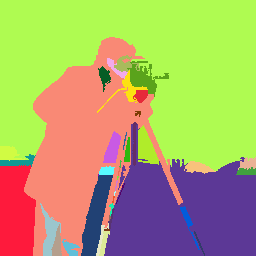
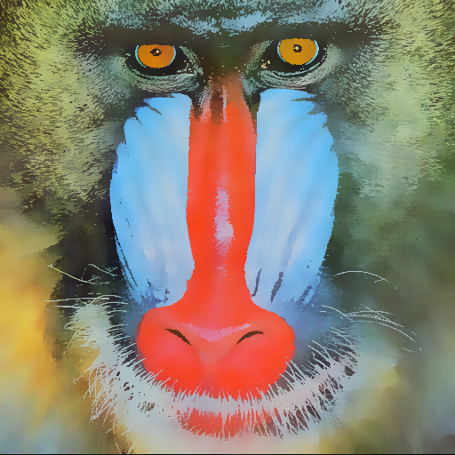
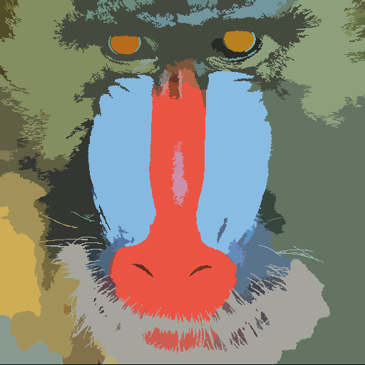
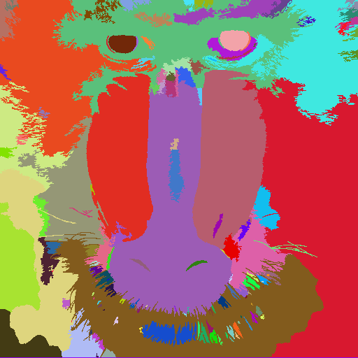
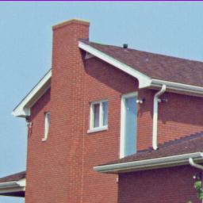
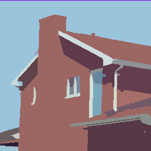
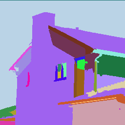

# Mean Shift Image Segmentation

*dependencies:* **opencv 4.0**, **openmp 3.0/4.0**

### **Build and Run**

Use **cmake** to build the project

```bash
mkdir build
cd build
cmake ..
make
./main #run the project with the images in the ./data folder
```

For each input image to mean shift algorithm, after the segmentation, it will pop up some windows for you to visualize the original image, filtered image, segmented image, and a segmented image filled with random colors.  

Each pop up window will block the program from continuing, press `esc` key to continue. After you press `esc` key, the previous windows will destroyed. 

All results will be save in folder `../data/result/`.

### **Results**

**Example 1. Camera Man**  
Original                   |    Filtered
:-------------------------:|:-------------------------:
 | 

Segmented                  |    Segmented Random Color
:-------------------------:|:-------------------------:
 | 

**Example 2. Mandrill**  
Original                   |    Filtered
:-------------------------:|:-------------------------:
 | 

Segmented                  |    Segmented Random Color
:-------------------------:|:-------------------------:
 | 

**Example 3. House**  
Original                   |    Filtered
:-------------------------:|:-------------------------:
 | 

Segmented                  |    Segmented Random Color
:-------------------------:|:-------------------------:
 | 

### **References**

D. Comaniciu and P. Meer, "Mean shift: a robust approach toward feature space analysis," _IEEE Transactions on Pattern Analysis and Machine Intelligence_, vol. 24, no. 5, pp. 603-619, May 2002, doi: 10.1109/34.1000236.  

D. Demirović, An Implementation of the Mean Shift Algorithm, _Image Processing On Line_, Sept 2019, pp. 251–268.

X. Hong, Parzen windows, _Lecture Notes_, Retrieved from http://www.personal.reading.ac.uk/~sis01xh/teaching/CY2D2/Pattern2.pdf